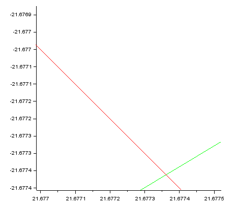

# Лабораторная работа 2
## Математическое моделирование
## Выполнил: Юдин Герман Станиславович 1032192868

# Задание
* Записать уравнение, описывающее движение катера, с начальными
условиями для двух случаев (в зависимости от расположения катера
относительно лодки в начальный момент времени).
* Построить траекторию движения катера и лодки для двух случаев.
* Найти точку пересечения траектории катера и лодки.

# Выполнение работы
Вариант 29
 На море в тумане катер береговой охраны преследует лодку браконьеров. Через определенный промежуток времени туман рассеивается, и лодка обнаруживается на расстоянии 11,8 км от катера. Затем лодка снова скрывается в тумане и уходит прямолинейно в неизвестном направлении. Известно, что скорость катера в 4,2 раза больше скорости браконьерской лодки.

## Аналитические рассуждения

* Принимает за T0 = 0, Xл0 = 0 - место нахождения лодки браконьеров в момент обнаружения, Xк0 = 11.8 км - место нахождения катера береговой охраны относительно лодки браконьеров в момент обнаружения лодки.
 

* Введем полярные координаты. Считаем, что полюс - это точка обнаружения лодки браконьеров Xл0, то есть 0, а полярная ось r проходит через точку нахождения катера береговой охраны.
 

* Траектория катера должна быть такой, чтобы и катер, и лодка все время были на одном расстоянии от полюса, то есть от нуля , только в этом случае траектория катера пересечется с траекторией лодки. Поэтому для начала катер береговой охраны должен двигаться некоторое время прямолинейно, пока не окажется на том же расстоянии от полюса, что и лодка браконьеров. После этого катер береговой охраны должен двигаться вокруг полюса удаляясь от него с той же скоростью, что и лодка браконьеров.

* Чтобы найти расстояние X, на котором начнётся движение вокруг полюса, необходимо составить простое уравнение. Пусть через время T катер и лодка окажутся на одном расстоянии X от полюса. За это время лодка пройдет X, а катер K-X или K+X, если катер в противоположной стороне от направления оси.

* Время, за которое они пройдут это расстояние, вычисляется как X / V или 11.8 +- X / (4.2 * V). Так как время одно и то же, то эти величины одинаковы. Тогда неизвестное расстояние X можно найти из следующего уравнения:
 

* Отсюда X1=59/26, а X2=59/19
 

* После того, как катер береговой охраны окажется на одном расстоянии от полюса, что и лодка, он должен сменить прямолинейную траекторию и начать двигаться вокруг полюса удаляясь от него со скоростью лодки V.

* Для этого скорость катера раскладываем на две составляющие: Vr - радиальная скорость и Vt тангенциальная скорость.
 

* Скорости можно записать через дифференциалы.
 
 При этом скорость радиальная, то есть скорость отдаления от полюса, должна быть равна скорости лодки.

* По теореме Пифагора, найдём тангенсальную скорость.
 

* С другой стороны тангенсальная скорость равна.
 

* Получим систему уравнений.
 
 И начальные данные
 

* Если её преобразовать, то получим уравнение траектории движения катера в полярных координатах.
 

## Программная реализация
* Так как мы получили 2 варианта ситуаций, то и пишем две программные реализации
 В первом случае Тетта равно 0, а R0 = 59/26
 
 Здесь указывается начальное расстояние, в какую сторону движется лодка, уравнение движения катера в полярных координатах, начальные данные для первого случая, массив движения от 0 до 2 пи, функция, описывающая движения лодки, а также время.
 
 Как видим на графике, катер догонит лодку на пересечении красной и зелёной линии. Это координаты (6.17565, -6.17565)
 

* Во втором случае Тетта равно -Пи, а R0 = 59/16
 
 Также как и в первом случае описание программы не меняется, остаются те же секции, но меняются только начальные данные.
 
 Как видим на графике, катер догонит лодку на пересечении красной и зелёной линии. Это координаты (21.67736, -21.67736)

 

# Вывод
Выполнив данную лабораторную работу, я ознакомился с решением задачи о погоне, описал её решение для своих данных, и реализовал графически движение лодки и катера для моего варианта.

# Список литературы
Лабораторная работа №1.pdf