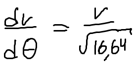
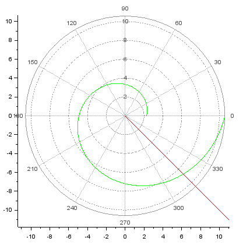
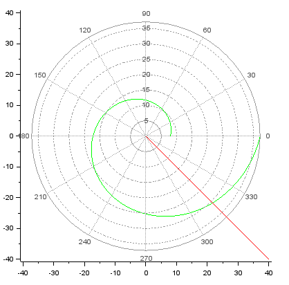

<h1 align="center">

РОССИЙСКИЙ УНИВЕРСИТЕТ ДРУЖБЫ НАРОДОВ 

Факультет физико-математических и естественных наук  

Кафедра прикладной информатики и теории вероятностей

ПРЕЗЕНТАЦИЯ ПО ЛАБОРАТОРНОЙ РАБОТЕ №2
  
<h2  align="right">

Дисциплина: Математическое моделирование

Преподователь: Кулябов Дмитрий Сергеевич

Студент: Юдин Герман Станивлавович

Группа: НФИбд-03-19
  
  
<h1 align="center">

МОСКВА

2022 г.
</h1>

# **Прагматика выполнения**

Scilab – это система компьютерной математики, которая предназначена для выполнения
инженерных и научных вычислений, таких как:

* решение нелинейных уравнений и систем;
* решение задач линейной алгебры;
* решение задач оптимизации;
* дифференцирование и интегрирование;
* задачи обработка экспериментальных данных (интерполяция и аппроксимация,
метод наименьших квадратов);
* решение обыкновенных дифференциальных уравнений и систем.

Знакомство и освоение Scilab значительно упростит процесс работы с математическими моделями для выбора правильной стратегии при решении задач поиска.

# **Цель работы** 

Цель данной работы - научиться выполнять построения математических моделей для выбора правильной стратегии при решении задач поиска.

# **Условия задачи**

Вариант 29

На море в тумане катер береговой охраны преследует лодку браконьеров. Через определенный промежуток времени туман рассеивается, и лодка обнаруживается на расстоянии 11,8 км от катера. Затем лодка снова скрывается в тумане и уходит прямолинейно в неизвестном направлении. Известно, что скорость катера в 4,2 раза больше скорости браконьерской лодки.

# **Задачи работы**

1. Провести рассуждения и вывод дифференциальных уравнений
2. Построить траекторию движения катера и лодки для двух случаев
3. Определить по графику точку пересечения катера и лодки

# **Результаты выполнения лабораторной работы** 

## 1 Вывод уравнения движения катера

Введем начальные данные (место нахождения лодки браконьеров в момент обнаружения и место нахождения катера береговой охраны относительно лодки браконьеров в момент обнаружения лодки) и опишем уравнение

Найдем расстояние, после которого катер начнет двигаться вокруг полюса через время за которое они пройдут это расстояние, вычисляется как x/v или (k+-x)/nv соответственно, которые мы и приравниваем, чтобы найти недостающие данные.

После того, как катер береговой охраны окажется на одном расстоянии от полюса, что и лодка, он должен сменить прямолинейную траекторию и начать двигаться вокруг полюса.

Для этого скорость катера разложили на две составляющие:
1. радиальная скорость – это скорость, с которой катер удаляется от полюса.
2. тангенциальная скорость – это линейная скорость вращения катера относительно полюса.

Решение исходной задачи свелось к решению системы из двух
дифференциальных уравнений с начальными условиями, зависящими от изначального расположения лодки относительно полюса:

Которые мы можем преобразовать к следующему виду:

## 2 Построение траектории движения катера

Затем строим траектории движения катера и лодки для обоих случаев

## 3 Нахождение точки пересечения траекторий

Затем при помощи графиков находим точки пересечения катера и лодки на первом графике: (6.17565, -6.17565)

и на втором графике: (21.67736, -21.67736)

# Выводы

Выполнив данную лабораторную работу, я ознакомился с решением задачи о погоне, описал её решение для своих данных, и реализовал графически движение лодки и катера для моего варианта, а также научился выполнять построения математических моделей для выбора правильной стратегии при решении задач поиска.
