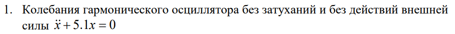
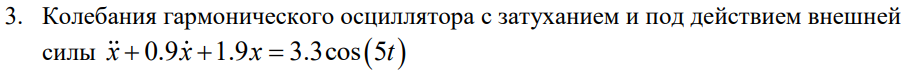
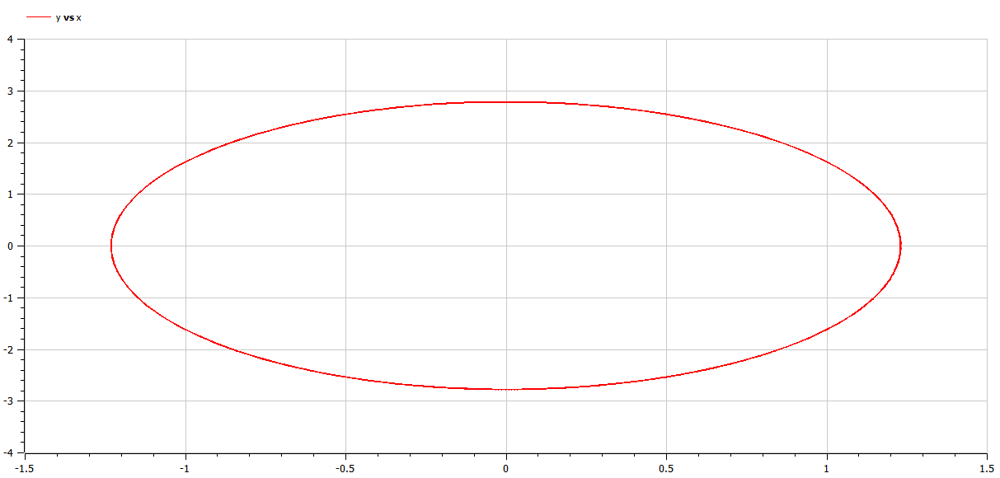
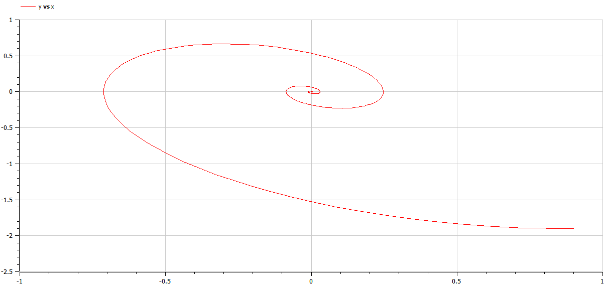
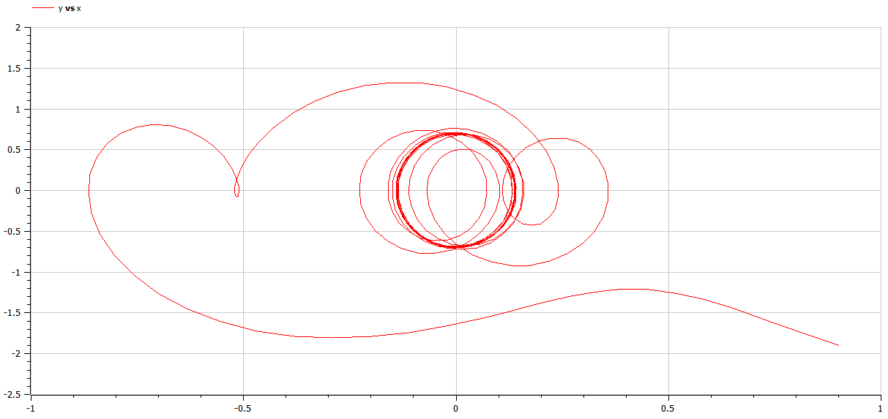

---
## Front matter
lang: ru-RU
title: Защита лабораторной работы №4
author: Юдин Герман
group: НФИбд-03-19
institute: RUDN University, Moscow, Russian Federation

## Formatting
toc: false
slide_level: 2
theme: metropolis
header-includes: 
 - \metroset{progressbar=frametitle,sectionpage=progressbar,numbering=fraction}
 - '\makeatletter'
 - '\beamer@ignorenonframefalse'
 - '\makeatother'
aspectratio: 43
section-titles: true
---

<h1 align="center">

РОССИЙСКИЙ УНИВЕРСИТЕТ ДРУЖБЫ НАРОДОВ 

Факультет физико-математических и естественных наук  

Кафедра прикладной информатики и теории вероятностей

ПРЕЗЕНТАЦИЯ ПО ЛАБОРАТОРНОЙ РАБОТЕ №4
  
<h2 align="right">

дисциплина: Математическое моделирование

Преподователь: Кулябов Дмитрий Сергеевич

Студент: Юдин Герман Станиславович

Группа: НФИбд-03-19
  
  
<h1 align="center">

МОСКВА

2022 г.
</h1>

# **Прагматика выполнения лабораторной работы**

- знакомство с моделью гармонических колебаний
- работа с OpenModelica

# **Цель работы**

Построение модели гармонических колебаний - фазового портрета гармонического осциллятора

# Задачи выполнения лабораторной работы

Построить фазовый портрет гармонического осциллятора и решение уравнения
гармонического осциллятора для следующих случаев:

На интервале t принадлежащему [0; 38] (шаг 0.05) с начальными условиями x0 = 0.9, y0 = -1.9

# **Выполнение лабораторной работы**

**_1 Колебания гармонического осциллятора без затуханий и без действий внешней силы_**

Реализуем в OpenModelica модель гармонического осциллятора без затуханий и без действий внешней силы и получаем фазовый портрет:

**_2 Колебания гармонического осциллятора c затуханием и без действий внешней силы_**

Реализуем в OpenModelica модель гармонического осциллятора с затуханием и без действий внешней силы и получаем фазовый портрет:

**_3 Колебания гармонического осциллятора c затуханием и под действием внешней силы_**

Реализуем в OpenModelica модель гармонического осциллятора c затуханием и под действием внешней силы и получаем фазовый портрет:

# Результаты выполнения лабораторной работы

- три модели в OpenModelica
- графики для трёх моделей

# Выводы

После завершения данной лабораторной работы - я научился выполнять построение различных моделей гармонических колебаний.
