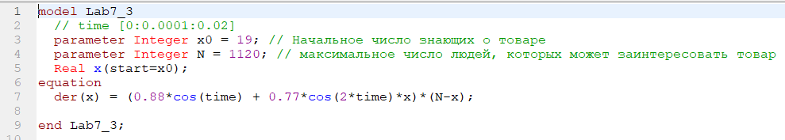

<!-- _class: titleslide -->

#### РОССИЙСКИЙ УНИВЕРСИТЕТ ДРУЖБЫ НАРОДОВ
#### Факультет физико-математических и естественных наук  
#### Кафедра прикладной информатики и теории вероятностей 
#### ПРЕЗЕНТАЦИЯ ПО ЛАБОРАТОРНОЙ РАБОТЕ №7

###### дисциплина: Математическое моделирование
###### Преподователь: Кулябов Дмитрий Сергеевич
###### Студент: Юдин Герман Станиславович
###### Группа: НФИбд-03-19
МОСКВА
2022 г.

---

# **Прагматика выполнения лабораторной работы**

- знакомство с моделью эффективности рекламы
- работа с OpenModelica

---

# **Цель работы**

Построение модели эффективности рекламы

---

# Задачи выполнения лабораторной работы

Для уравнений эффективности рекламы:

Постройте графики распространения рекламы.
При этом объем аудитории N = 1120, в начальный момент о товаре знает 19 человек. Для случая 2 определите в какой момент времени скорость распространения рекламы будет
иметь максимальное значение.

---

# **Выполнение лабораторной работы**

**_Построение модели эффективности рекламы_**

Уравнения для модели варианта-29:

---

Чтобы построить график распространения информации о товаре с учетом платной рекламы и с учетом сарафанного радио для первого уравнения, я написал следующий код:

---

и получил график:

---

Чтобы построить график распространения информации о товаре с учетом платной рекламы и с учетом сарафанного радио для второго уравнения, я написал следующий код:

---

и получил график. Распространение достигает максимальной точки, в момент, когда количество знающих людей становится равным половине от максимума:

---

Чтобы построить график распространения информации о товаре с учетом платной рекламы и с учетом сарафанного радио для третьего уравнения, я написал следующий код:

---

и получил график:

---

# Выводы

После завершения данной лабораторной работы - я научился выполнять построение модели распространения информации о товаре с учетом платной рекламы и с учетом сарафанного радио в OpenModelica.
